# BankApplication
# **🏦 Banking Application**  

Welcome to the **Banking Application** – a full-stack **Spring Boot + Angular** project that simulates an online banking system. This project includes essential banking functionalities such as **customer and employee management, transactions, deposits, PIN updates, and secure authentication**.

---

## **📌 Features**
### **🚀 Admin Panel**
✅ Admin login authentication using **Spring Security**  
✅ **Add, View, Update & Delete Employees**  
✅ **Add, View, Update & Delete Customers**  

### **👨‍💼 Employee Panel**
✅ Employee login authentication  
✅ **Add new customer accounts**  
✅ **View and manage customer details**  

### **👤 Customer Panel**
✅ Customer login using **Account No & PIN**  
✅ **Deposit money into the account**  
✅ **Transfer funds between accounts**  
✅ **Check balance and account details**  
✅ **Update account PIN securely**  

---

## **📸 Project Screenshots**
| 🖼️ Screenshot | Description |
|--------------|-------------|
| 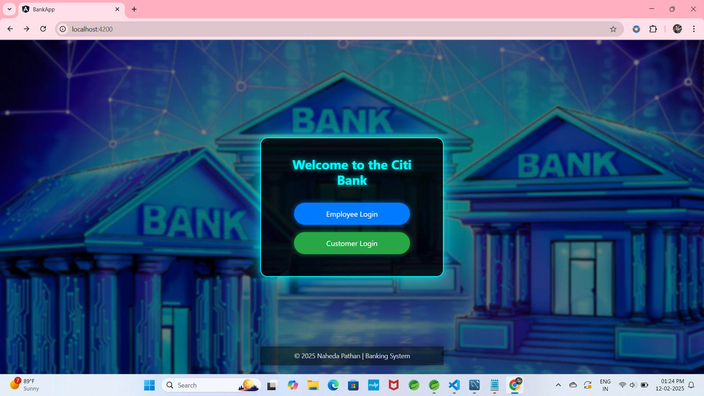 | 
| 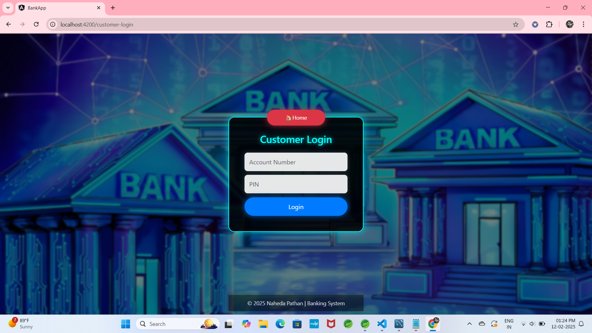 |
| 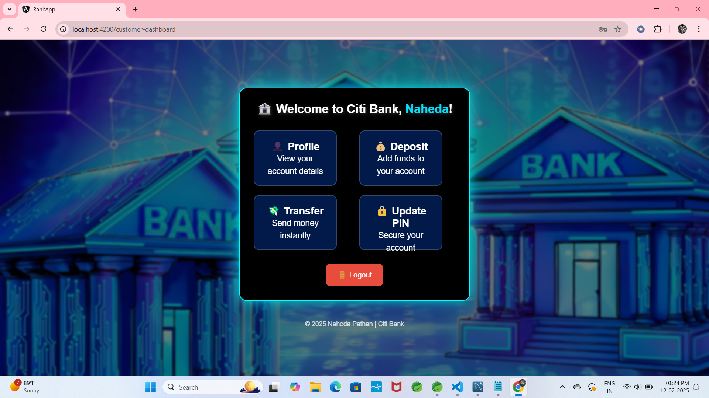 | 
| 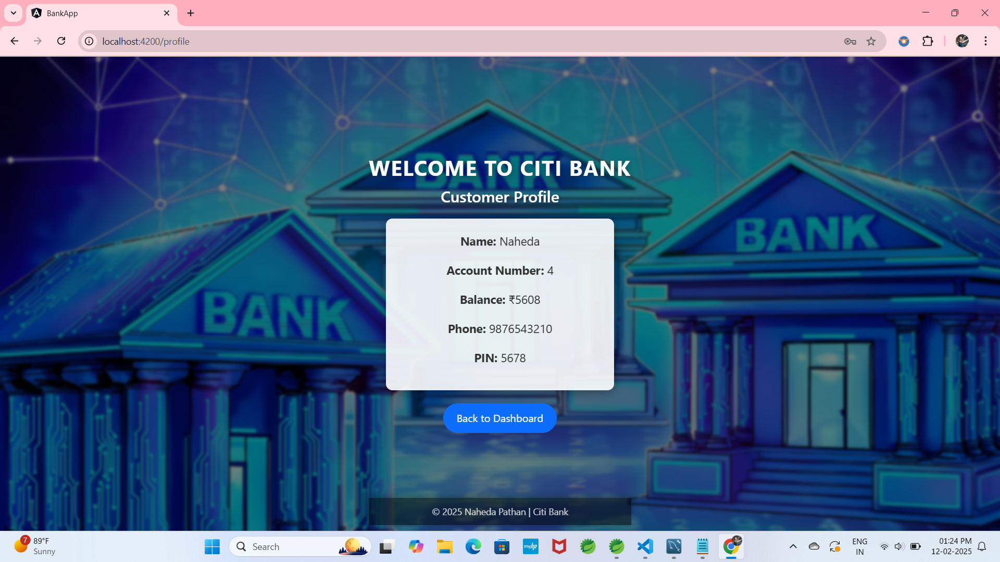 | 
| 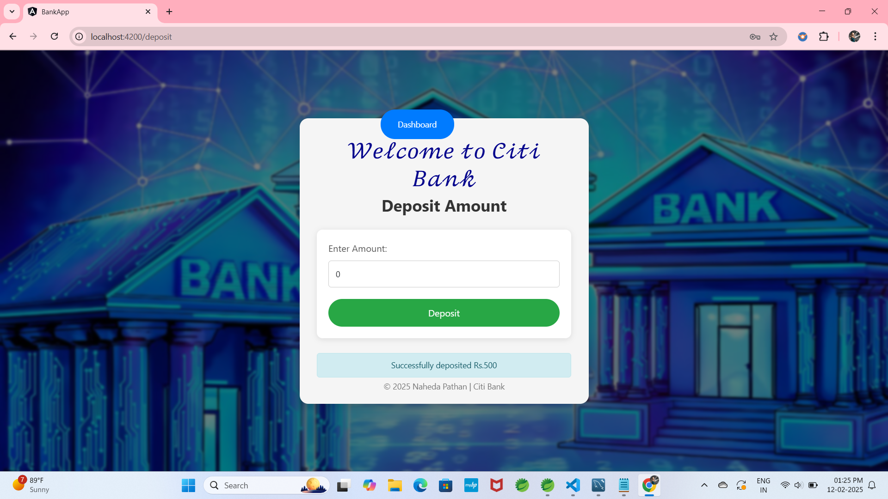 | 
| 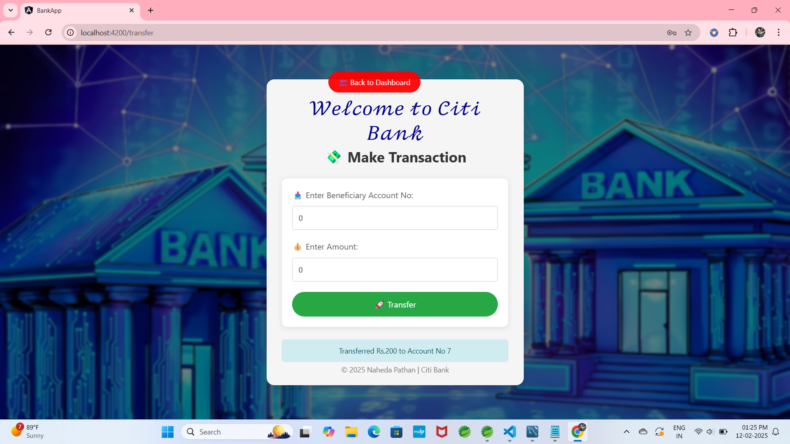 |
| 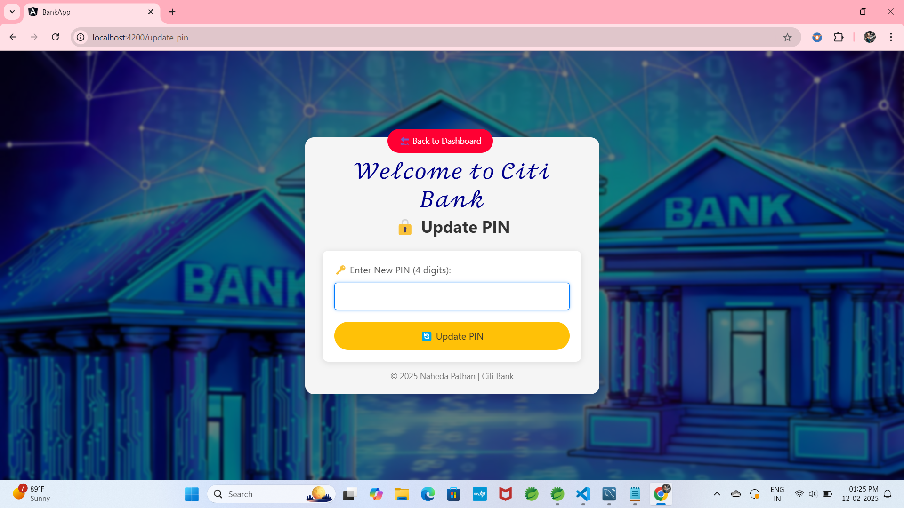 | 
| 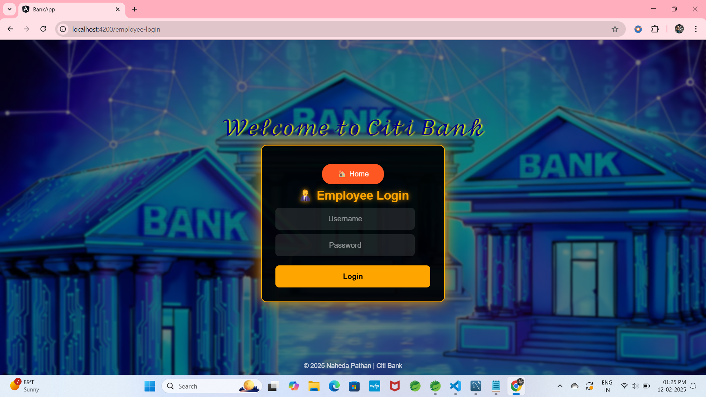 |
| 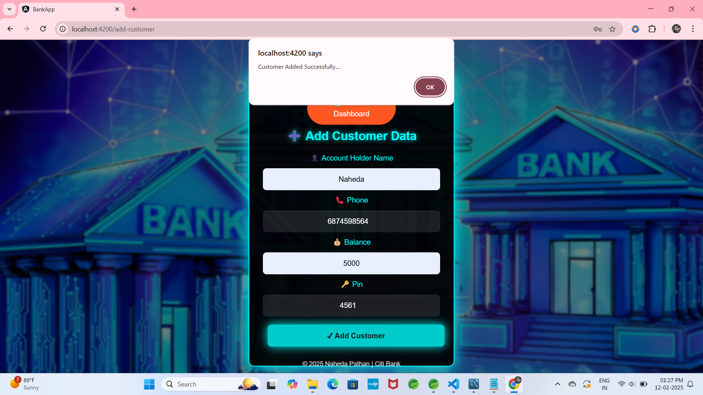 | 
| 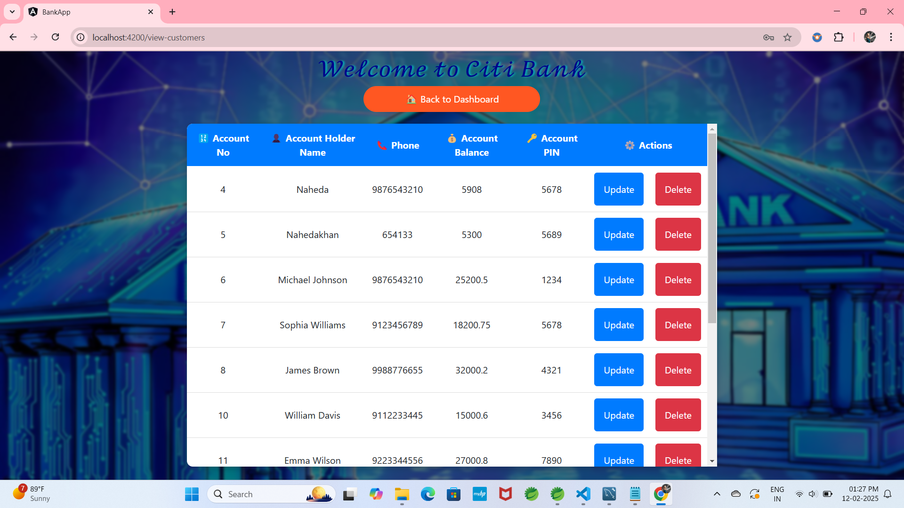 |
| 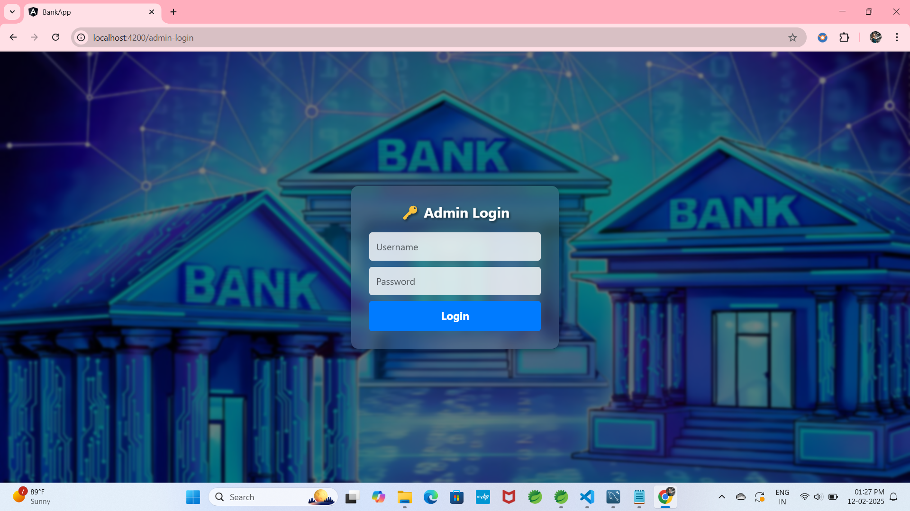 | 
| 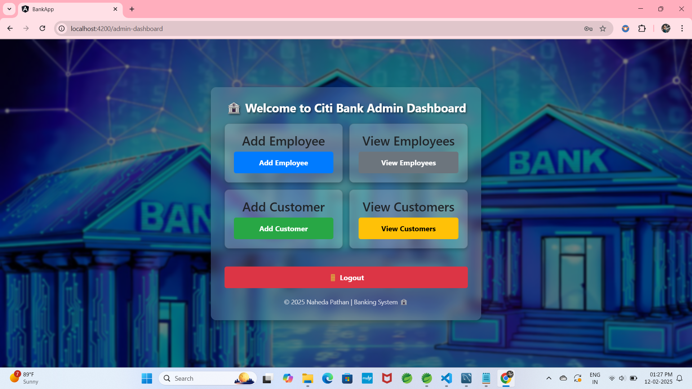 |
| 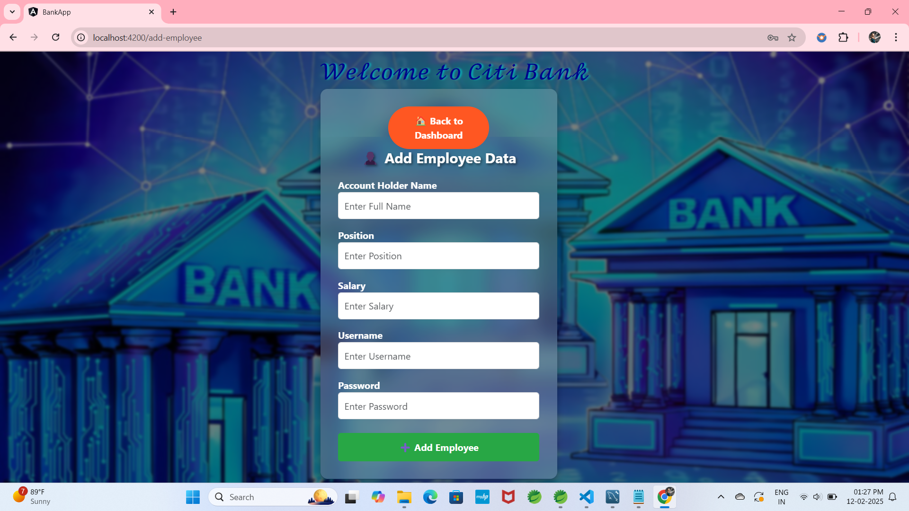 | 
| 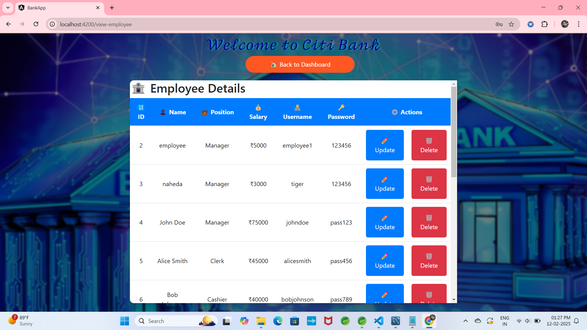 |
| 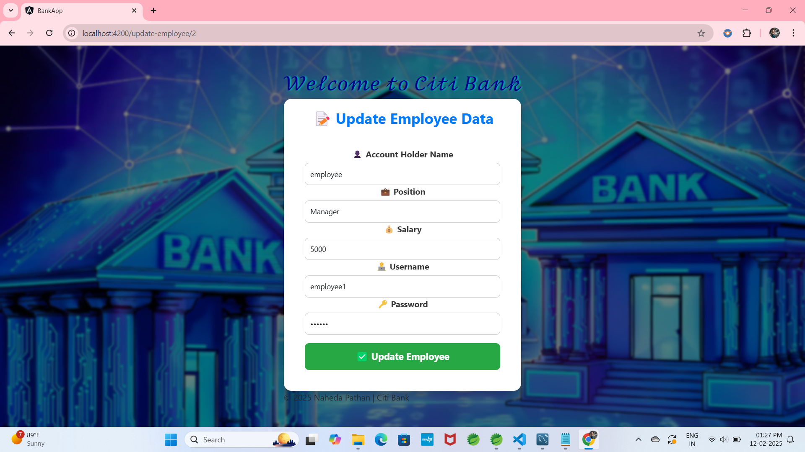 | 
| 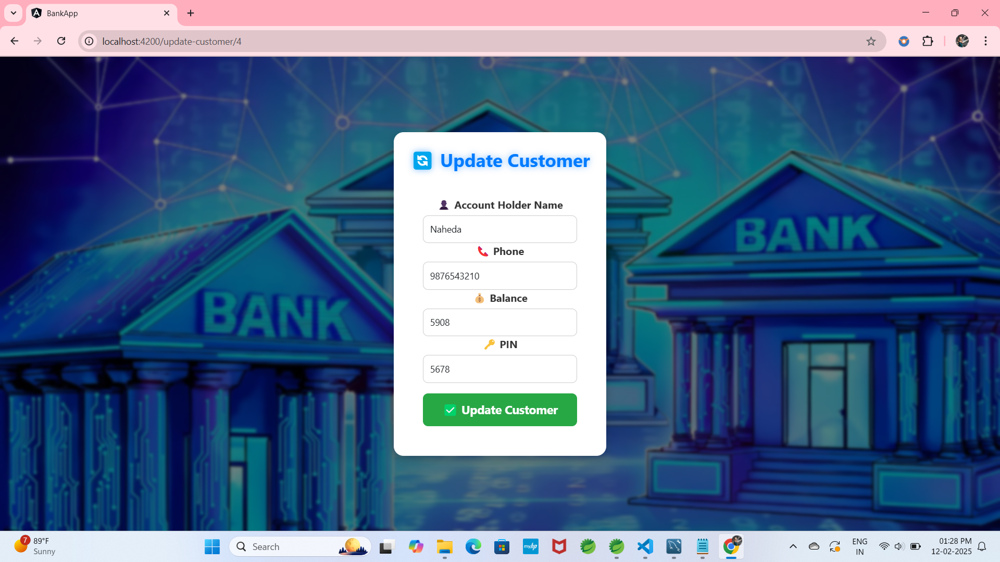 | 

---

## **🛠️ Technologies Used**
### **🌐 Frontend (Angular)**
- **Angular 17**
- **TypeScript**
- **Bootstrap 5**
- **HTML5, CSS3**
- **Angular Routing**
  
### **🚀 Backend (Spring Boot)**
- **Spring Boot 3.2.5**
- **Spring Security (for authentication)**
- **Spring Data JPA (Hibernate)**
- **MySQL (Database)**
- **RESTful APIs**

---

## **💻 How to Run the Project**
### **1️⃣ Backend (Spring Boot) Setup**
1. **Clone the repository**:
   ```bash
   git clone https://github.com/nahedapathan/Banking-Application.git
   ```
2. **Navigate to backend folder**:
   ```bash
   cd Banking-Application/backend
   ```
3. **Configure MySQL Database** in `application.properties`:
   ```properties
   spring.datasource.url=jdbc:mysql://localhost:3306/bank_db
   spring.datasource.username=root
   spring.datasource.password=yourpassword
   ```
4. **Run the Spring Boot application**:
   ```bash
   mvn spring-boot:run
   ```

### **2️⃣ Frontend (Angular) Setup**
1. **Navigate to frontend folder**:
   ```bash
   cd ../frontend
   ```
2. **Install dependencies**:
   ```bash
   npm install
   ```
3. **Run the Angular application**:
   ```bash
   ng serve --open
   ```
4. **Open in Browser**: `http://localhost:4200`

---

## **🔐 Login Credentials**
| User Type | Username / Account No | Password / PIN |
|-----------|----------------------|---------------|
| **Admin** | `admin` | `admin123` |
| **Employee** | `johndoe` | `pass123` |
| **Customer** | `100001` | `1234` |

---

## **📢 Contributing**
💡 Found a bug or have a feature request? Feel free to **fork the repo**, create an issue, or submit a pull request!

---

## **📜 License**
This project is **free to use** for learning and educational purposes.

---

## **📞 Contact**

---

This **Banking System** provides a full-stack **Angular + Spring Boot** experience. Feel free to ⭐ **star** this repository and share your feedback! 🚀🔥
